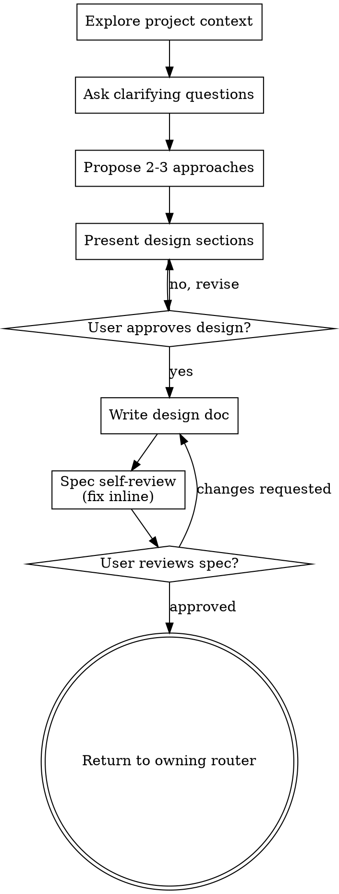

# Brainstorming Ideas Into Designs

## SOP adapter

Loaded only by `sop-orchestrator` (ARCH phase B / UI when named). HARD-GATE below applies to **this design conversation**, not to the CODE stage. Do not route `dev-agent` until `ARCH_SIGNOFF` and `TEST_PACK_READY` are confirmed in conversation. Visual companion: prefer **`cursor-ide-browser`**.

### SOP context overrides

When SOP supplies a UI or ARCH artifact root, it overrides this skill's generic
paths and terminal action:

| Context | Canonical output | Terminal action |
|---------|------------------|-----------------|
| UI | `E:/workspace/ai-font-design/projects/<slug>/design/design-spec.md` | Return to `sop-orchestrator` for ARCH routing |
| ARCH | Files selected by `prd-to-arch-design` under `E:/workspace/ai_architecture_design/projects/<slug>/design/` | Return to `prd-to-arch-design` for grill/package |

Do not write SOP-owned work to `docs/superpowers/specs/`, commit it, invoke
`writing-plans`, or start implementation. In UI context,
`visual-choice-first` also overrides the just-in-time companion rule: perform
the upfront six-direction visual gate before the design conversation.

Help turn ideas into fully formed designs and specs through natural collaborative dialogue.

Start by understanding the current project context, then ask questions one at a time to refine the idea. Once you understand what you're building, present the design and get user approval.

<HARD-GATE>
Do NOT invoke any implementation skill, write any code, scaffold any project, or take any implementation action until you have presented a design and the user has approved it. This applies to EVERY project regardless of perceived simplicity.
</HARD-GATE>

## Anti-Pattern: "This Is Too Simple To Need A Design"

Every project goes through this process. A todo list, a single-function utility, a config change — all of them. "Simple" projects are where unexamined assumptions cause the most wasted work. The design can be short (a few sentences for truly simple projects), but you MUST present it and get approval.

## Checklist

You MUST create a task for each of these items and complete them in order:

1. **Explore project context** — check files, docs, recent commits
2. **Choose visual timing** — SOP UI uses `visual-choice-first` upfront; otherwise offer the visual companion just-in-time when genuinely useful.
3. **Ask clarifying questions** — one at a time, understand purpose/constraints/success criteria
4. **Propose 2-3 approaches** — with trade-offs and your recommendation
5. **Present design** — in sections scaled to their complexity, get user approval after each section
6. **Write design doc** — use the SOP context path above; outside SOP use `docs/superpowers/specs/YYYY-MM-DD-<topic>-design.md`
7. **Spec self-review** — quick inline check for placeholders, contradictions, ambiguity, scope (see below)
8. **User reviews written spec** — ask user to review the spec file before proceeding
9. **Return to owner** — UI returns to SOP/ARCH; ARCH returns to `prd-to-arch-design`; generic non-SOP use may invoke `writing-plans`

## Process Flow

**In SOP UI/ARCH contexts, the terminal state is returning to the owning
router.** Do not invoke an implementation skill. Outside SOP, the generic
terminal action remains `writing-plans`.

## The Process

**Understanding the idea:**

- Check out the current project state first (files, docs, recent commits)
- Before asking detailed questions, assess scope: if the request describes multiple independent subsystems (e.g., "build a platform with chat, file storage, billing, and analytics"), flag this immediately. Don't spend questions refining details of a project that needs to be decomposed first.
- If the project is too large for a single spec, help the user decompose into sub-projects: what are the independent pieces, how do they relate, what order should they be built? Then brainstorm the first sub-project through the normal design flow. Each sub-project gets its own spec → plan → implementation cycle.
- For appropriately-scoped projects, ask questions one at a time to refine the idea
- Prefer multiple choice questions when possible, but open-ended is fine too
- Only one question per message - if a topic needs more exploration, break it into multiple questions
- Focus on understanding: purpose, constraints, success criteria

**Exploring approaches:**

- Propose 2-3 different approaches with trade-offs
- Present options conversationally with your recommendation and reasoning
- Lead with your recommended option and explain why

**Presenting the design:**

- Once you believe you understand what you're building, present the design
- Scale each section to its complexity: a few sentences if straightforward, up to 200-300 words if nuanced
- Ask after each section whether it looks right so far
- Cover: architecture, components, data flow, error handling, testing
- Be ready to go back and clarify if something doesn't make sense

**Design for isolation and clarity:**

- Break the system into smaller units that each have one clear purpose, communicate through well-defined interfaces, and can be understood and tested independently
- For each unit, you should be able to answer: what does it do, how do you use it, and what does it depend on?
- Can someone understand what a unit does without reading its internals? Can you change the internals without breaking consumers? If not, the boundaries need work.
- Smaller, well-bounded units are also easier for you to work with - you reason better about code you can hold in context at once, and your edits are more reliable when files are focused. When a file grows large, that's often a signal that it's doing too much.

**Working in existing codebases:**

- Explore the current structure before proposing changes. Follow existing patterns.
- Where existing code has problems that affect the work (e.g., a file that's grown too large, unclear boundaries, tangled responsibilities), include targeted improvements as part of the design - the way a good developer improves code they're working in.
- Don't propose unrelated refactoring. Stay focused on what serves the current goal.

## After the Design

**Documentation:**

- In SOP UI/ARCH contexts, write to the canonical stage path in the adapter.
- Outside SOP, write the validated design to
  `docs/superpowers/specs/YYYY-MM-DD-<topic>-design.md` unless the user chooses
  another path.
- Use elements-of-style:writing-clearly-and-concisely skill if available
- Commit only when the user explicitly asks; SOP stage completion does not
  imply commit authorization.

**Spec Self-Review:**
After writing the spec document, look at it with fresh eyes:

1. **Placeholder scan:** Any "TBD", "TODO", incomplete sections, or vague requirements? Fix them.
2. **Internal consistency:** Do any sections contradict each other? Does the architecture match the feature descriptions?
3. **Scope check:** Is this focused enough for a single implementation plan, or does it need decomposition?
4. **Ambiguity check:** Could any requirement be interpreted two different ways? If so, pick one and make it explicit.

Fix any issues inline. No need to re-review — just fix and move on.

**User Review Gate:**
After the spec review loop passes, ask the user to review the written spec before proceeding:

> "Spec written to `<path>`. Please review it and confirm or request changes in this conversation."

Wait for the user's response. If they request changes, make them and re-run the spec review loop. Only proceed once the user approves.

**Next owner:**

- SOP UI: stop at `design-spec.md` and return to `sop-orchestrator` for ARCH.
- SOP ARCH: return to `prd-to-arch-design`; it owns grill, package, and plan.
- Generic non-SOP use: invoke `writing-plans`.
- Never interpret design approval as direct CODE authorization.

## Key Principles

- **One question at a time** - Don't overwhelm with multiple questions
- **Multiple choice preferred** - Easier to answer than open-ended when possible
- **YAGNI ruthlessly** - Remove unnecessary features from all designs
- **Explore alternatives** - Always propose 2-3 approaches before settling
- **Incremental validation** - Present design, get approval before moving on
- **Be flexible** - Go back and clarify when something doesn't make sense

## Visual Companion

A browser-based companion for showing mockups, diagrams, and visual options during brainstorming. Available as a tool — not a mode. Accepting the companion means it's available for questions that benefit from visual treatment; it does NOT mean every question goes through the browser.

**Offering the companion (just-in-time, except SOP UI):** Outside SOP UI, do
not offer it upfront. Wait until a question would genuinely be clearer shown
than told. In SOP UI, `visual-choice-first` wins and opens the six-direction
visual choice before this just-in-time policy applies to later questions.
> "This next part might be easier if I show you — I can put together mockups, diagrams, and comparisons in a browser tab as we go. It's still new and can be token-intensive. Want me to? I'll open it for you."

**This offer MUST be its own message.** Only the offer — no clarifying question, summary, or other content. Wait for the user's response. If they accept, start the server with `--open` so their browser opens to the first screen automatically. If they decline, continue text-only and don't offer again unless they raise it.

**Per-question decision:** Even after the user accepts, decide FOR EACH QUESTION whether to use the browser or the terminal. The test: **would the user understand this better by seeing it than reading it?**

- **Use the browser** for content that IS visual — mockups, wireframes, layout comparisons, architecture diagrams, side-by-side visual designs
- **Use the terminal** for content that is text — requirements questions, conceptual choices, tradeoff lists, A/B/C/D text options, scope decisions

A question about a UI topic is not automatically a visual question. "What does personality mean in this context?" is a conceptual question — use the terminal. "Which wizard layout works better?" is a visual question — use the browser.

If they agree to the companion, read the detailed guide before proceeding:
`skills/brainstorming/visual-companion.md`
